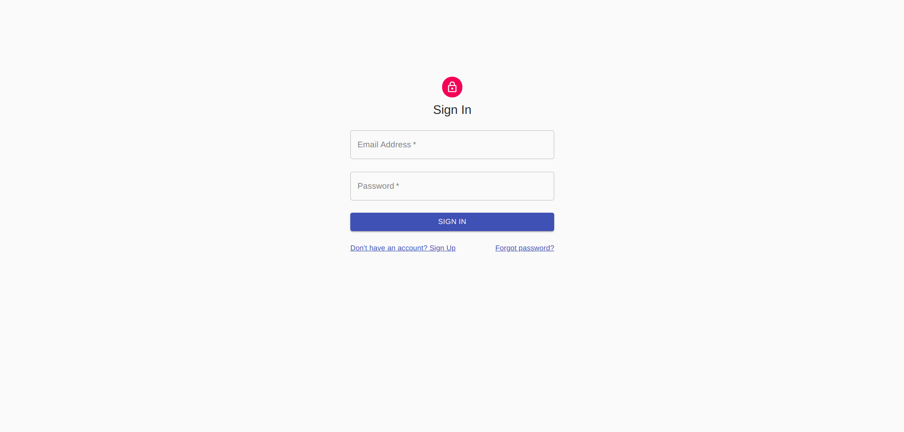
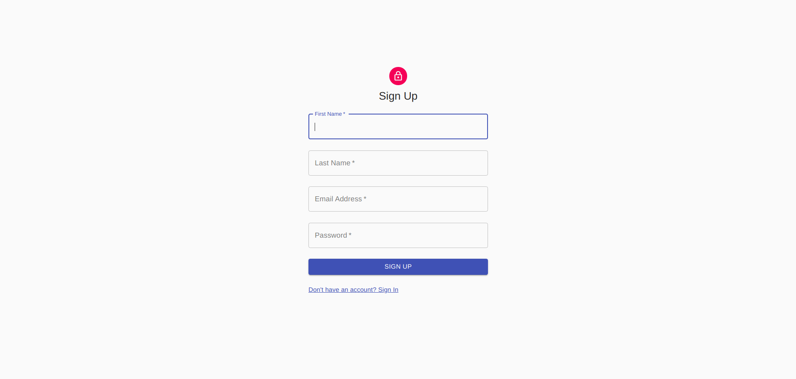
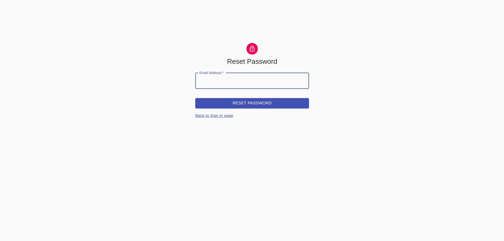
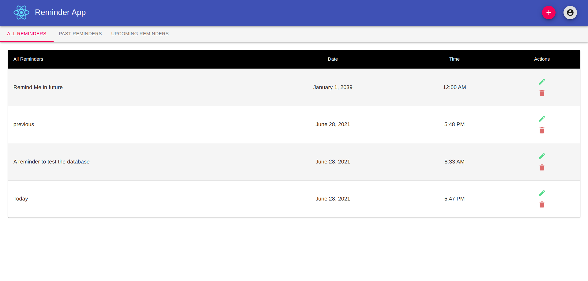
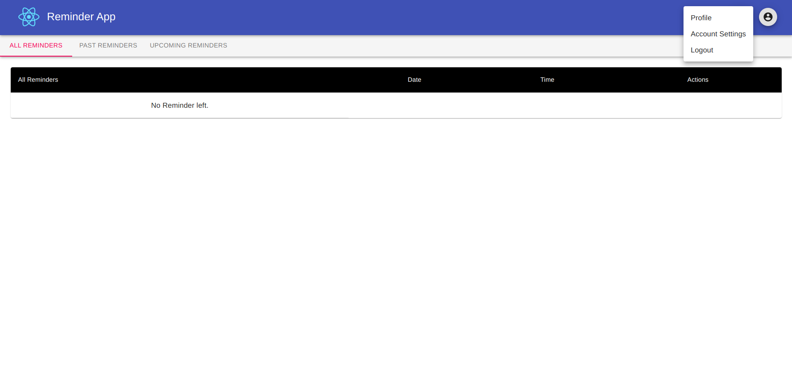

# React-Assignment-10
Using all the concepts of hooks you have gathered till now let's create a react app to achieve the following: 
```
* a simple reminder app  
* you can create reminders  
* a reminder would consist of a title  
* Time and date at which to remind   
* these reminders can be added updated and delete  also, 
* separate list showing all the upcoming reminders and the past reminders  
* Since this is a frontend task  
* please take user experience into consideration 
```

## Pending
```
1. Problem with useEffect to set allReminders. (NOTE: fetch data is work in realtime but not render in realtime)
```

## Images

**Sign In**


**Sign Up**


**Forgot Password**


**Home Landing Page**


**Home Profile Section**

