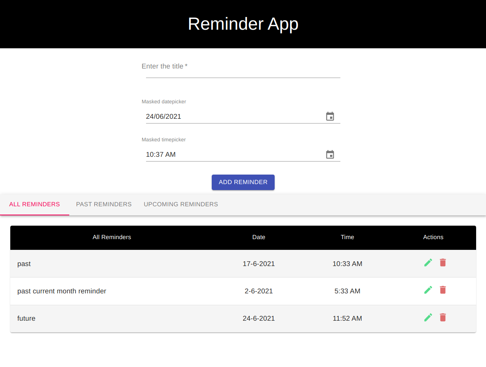
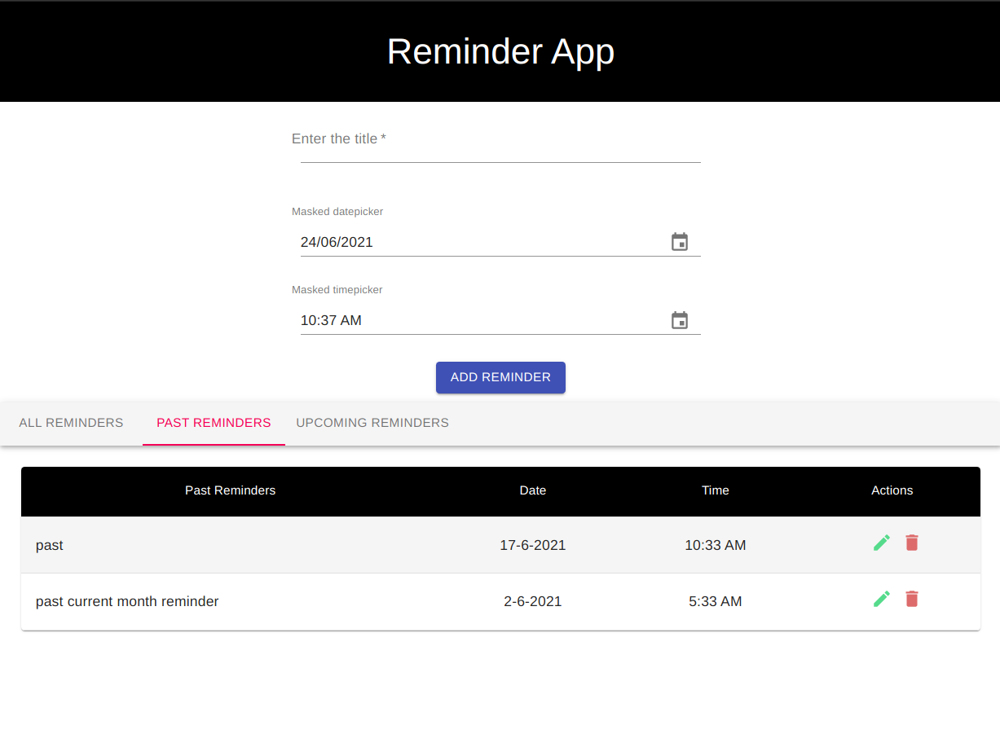
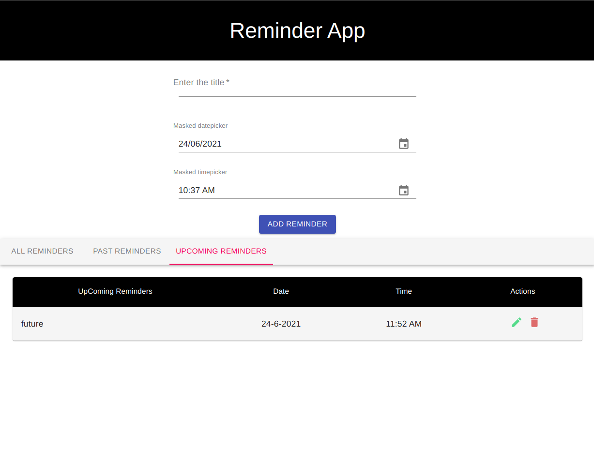

# React-Assignment-10
Using all the concepts of hooks you have gathered till now let's create a react app to achieve the following:  
* a simple reminder app  
* you can create reminders  
* a reminder would consist of a title  
* Time and date at which to remind   
* these reminders can be added updated and delete  also, 
* separate list showing all the upcoming reminders and the past reminders  
* Since this is a frontend task  
* please take user experience into consideration 


## Feature
```
1. Date & Time not updated.
```

## Images

**All Reminders**


**Past Reminders**


**Upcoming Reminders**
